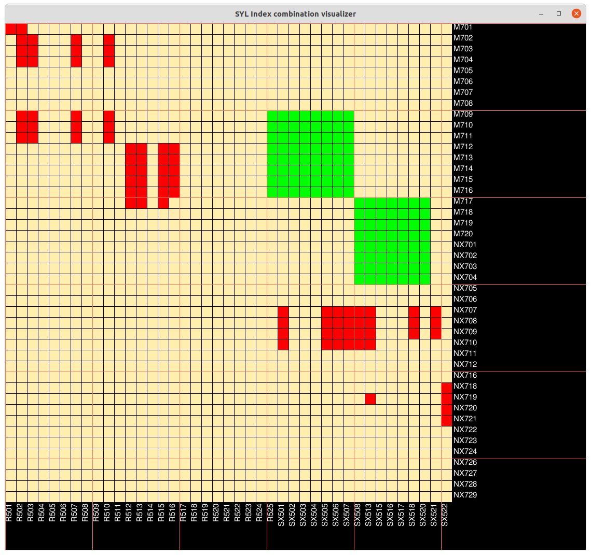

# SYL Index Combination Software

Coming up with index combinations is not trivial, because one has to think of how to:
	- Combine pairwise indices
	- In a way that increases base diversity
	- And practical in the lab (eg: multichannel pipetting)
	- All this while avoiding index clashes with samples requiring topup from previous runs
This mental is usually done in one's head, so communicating the constraints of index combination in a run is also another hassle.

Since index combination is usually pairwise (forward and reverse index, at least for Nextera and NEB), then the easiest way of doing index combination is thinking tick-tack-toe. And if it can read previous sample sheet to indicate where index combinations have been used that can clash, even better.

## SCREENSHOT

| Color | Description |
|--|--|
| Beige | Not chosen |
| Green | Selected |
| Red | Marked, WILL CLASH |

## How to start
 - Input your samplesheet if you have one. It should follow the general MiSeq sample sheet format.
 - Start!

## How to interact with the grid
 - Bottom axis shows i7 indices
 - Right axis shows i5 indices
 - Left click to choose indices. It will be marked from beige to green
 	- To cancel, left click on it again
 - Middle button to mark manually mark index comb. as clash
 	- To cancel, middle click on it again
 - To mark multiple indices, click-hold-drag-letgo

## TODO:
 - Enable inputting sample sheet of used
 	- At the moment, index combination is restricted to Nextera
 	- Need to allow switching between Nextera and NEB
 - How to have a software icon?
 	- Right now, the software is ran by running the python script directly
	- If I can access from the start button, that would be awesome
